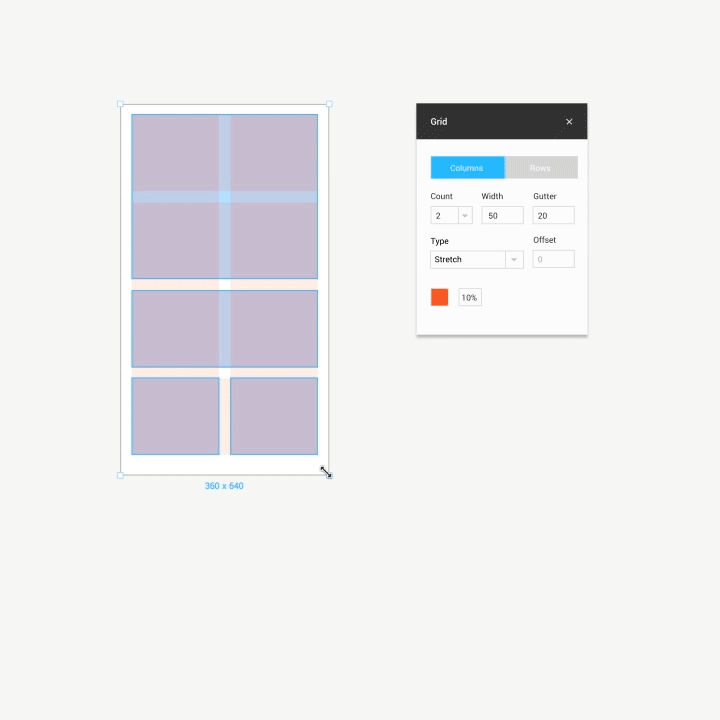

Les grilles (Layout Grids) sont une fonctionnalité très utile.

Dans Figma, les grilles sont appliquées sur les objets "Frame" (cadres). Chaque cadre peut avoir une ou plusieurs grilles.

Il existe trois types de grilles: 

* Grid (pixels)
* Columns (colonnes verticales)
* Rows (rangées horizontales).

### Tutoriel vidéo

<iframe width="100%" height="315" src="https://www.youtube-nocookie.com/embed/zd8wrAdURN0" frameborder="0" allow="autoplay; encrypted-media" allowfullscreen></iframe>