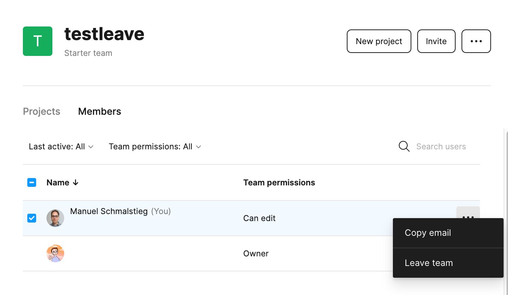

## Comment quitter une team Figma ?

Si vous voulez quitter une équipe, la procédure est la suivante:

- Aller dans l'onglet *Members*
- À côté de votre nom, aller dans le menu ••• et choisir “Leave Team”.

